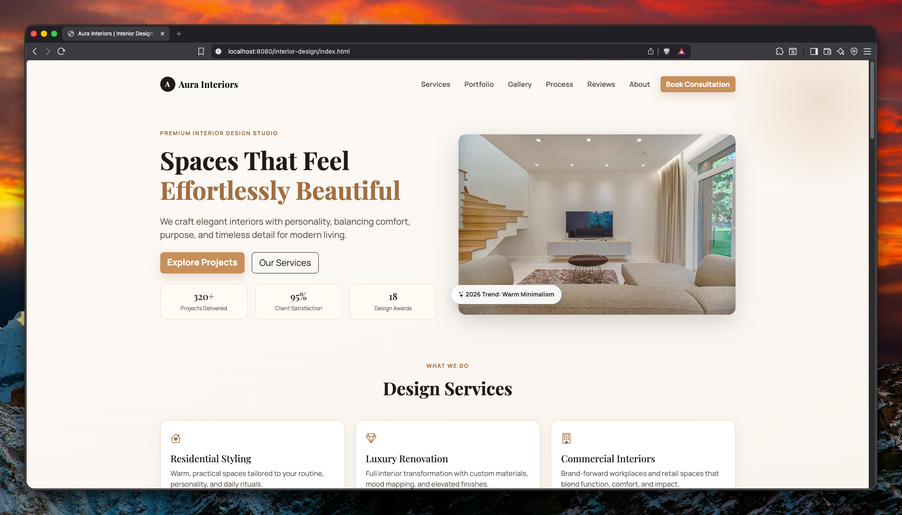
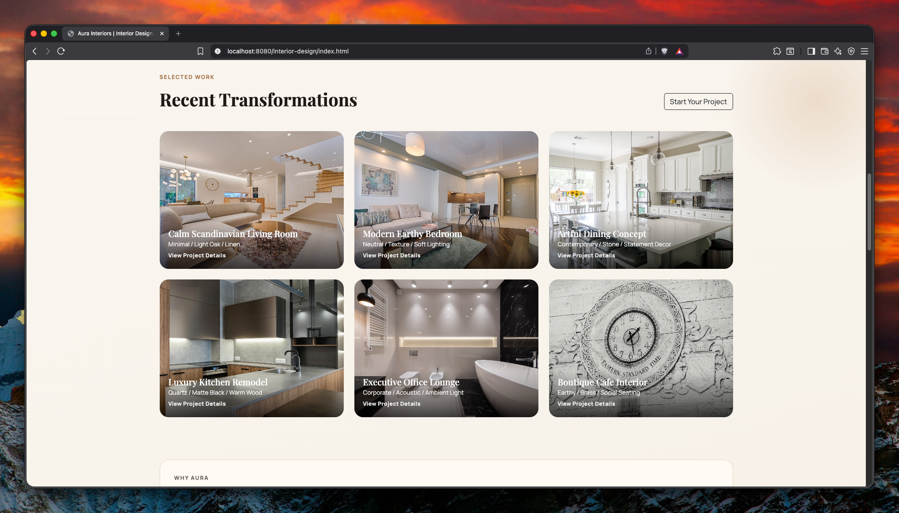

# Interior Design Webpage

A premium interior design website built with PHP, HTML, CSS, JavaScript, and Bootstrap.

## Live Demo
[https://interior-design-php.vercel.app/](https://interior-design-php.vercel.app/)

## Features
- Modern responsive landing page design
- Services, portfolio, gallery, testimonials, and FAQ sections
- Project detail pages (`project.html?slug=...`)
- Image preview modal for gallery items
- Customer inquiry modal form with validation

## Tech Stack
- PHP
- HTML5
- CSS3
- JavaScript (Vanilla)
- Bootstrap 5

## Project Structure
```text
interior-design/
├── assets/
│   ├── css/
│   ├── js/
│   └── images/
├── screenshots/
├── index.php
├── index.html
├── project.html
├── vercel.json
└── README.md
```

## Run Locally (XAMPP)
1. Put the project in `htdocs/interior-design`.
2. Start Apache from XAMPP.
3. Open: `http://localhost/interior-design/index.php`

## Screenshots
### Home Page


### Interior Sections


## Deployment
This project is configured for static-style deployment on Vercel using `vercel.json`.
